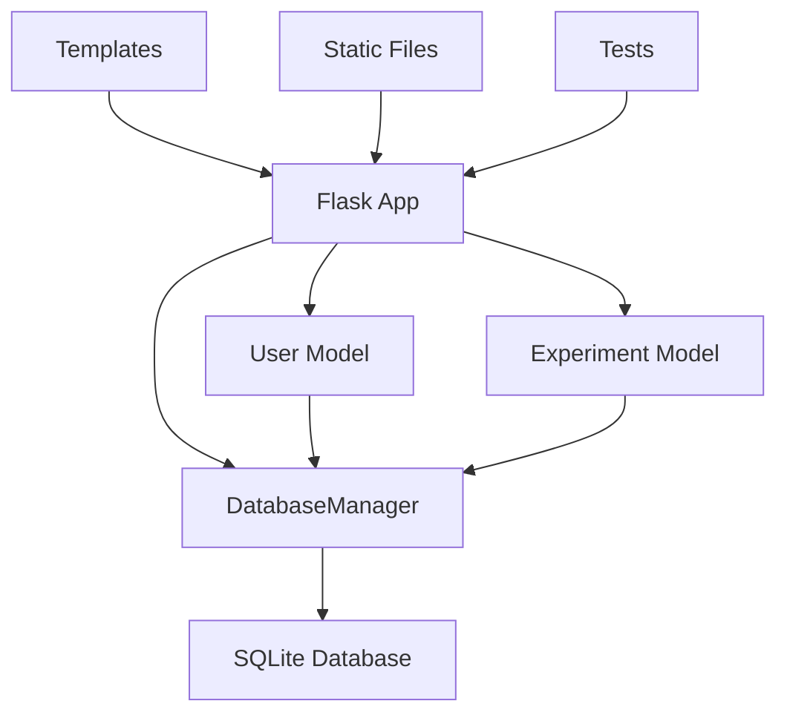

# Module & Class Structure

## Overview

The ML Experiments Tracker follows a modular architecture with clear separation of concerns. The application is structured into logical modules that handle specific functionality while maintaining loose coupling.

## Project Structure

```
Shipsy/
├── app.py                 # Main Flask application
├── models.py             # Database models and business logic
├── requirements.txt      # Python dependencies
├── static/              # Static assets
│   ├── css/style.css    # Custom styles
│   └── js/main.js       # Client-side JavaScript
├── templates/           # HTML templates
│   ├── base.html        # Base template
│   ├── login.html       # Login page
│   ├── dashboard.html   # Dashboard page
│   ├── experiment_form.html  # Create/Edit form
│   └── experiment_detail.html # Experiment detail view
├── tests/              # Test files
│   └── test_app.py     # Application tests
└── docs/               # Documentation
    ├── schema_design.md
    ├── module_structure.md
    ├── ai_prompts.md
    ├── test_plan.md
    └── reflection.md
```

## Core Modules

### 1. Main Application (`app.py`)

**Purpose:** Flask application entry point and route definitions

**Key Components:**
- Flask app initialization
- Route definitions for all endpoints
- Authentication middleware
- Error handlers

**Main Classes/Functions:**

```python
# Application Configuration
app = Flask(__name__)
app.secret_key = os.environ.get('SECRET_KEY', 'dev-secret-key')

# Authentication Decorator
def login_required(f):
    """Decorator to require login for protected routes"""
    @wraps(f)
    def decorated_function(*args, **kwargs):
        if 'user_id' not in session:
            flash('Please log in to access this page.', 'error')
            return redirect(url_for('login'))
        return f(*args, **kwargs)
    return decorated_function

# Route Handlers
@app.route('/')
def index():
    """Redirect to login if not authenticated, otherwise to dashboard"""

@app.route('/login', methods=['GET', 'POST'])
def login():
    """Handle user login"""

@app.route('/dashboard')
@login_required
def dashboard():
    """Main dashboard with experiments list"""

@app.route('/experiment/new', methods=['GET', 'POST'])
@login_required
def new_experiment():
    """Create a new experiment"""

@app.route('/experiment/<int:experiment_id>')
@login_required
def view_experiment(experiment_id):
    """View a specific experiment"""

@app.route('/experiment/<int:experiment_id>/edit', methods=['GET', 'POST'])
@login_required
def edit_experiment(experiment_id):
    """Edit an existing experiment"""

@app.route('/experiment/<int:experiment_id>/delete', methods=['POST'])
@login_required
def delete_experiment(experiment_id):
    """Delete an experiment"""

@app.route('/api/experiments')
@login_required
def api_experiments():
    """API endpoint for experiments (for AJAX requests)"""
```

### 2. Database Models (`models.py`)

**Purpose:** Database abstraction layer and business logic

**Key Components:**
- Database connection management
- User authentication logic
- Experiment CRUD operations
- Data validation

**Main Classes:**

#### DatabaseManager Class
```python
class DatabaseManager:
    """Manages database connections and initialization"""
    
    def __init__(self, db_path: str = "experiments.db"):
        self.db_path = db_path
        self.init_database()
    
    def get_connection(self):
        """Get database connection with row factory"""
    
    def init_database(self):
        """Initialize database with required tables and indexes"""
```

#### User Class
```python
class User:
    """Handles user authentication and management"""
    
    def __init__(self, db_manager: DatabaseManager):
        self.db_manager = db_manager
    
    def create_user(self, username: str, password: str) -> bool:
        """Create a new user with hashed password"""
    
    def authenticate(self, username: str, password: str) -> bool:
        """Authenticate user with username and password"""
    
    def get_user_by_username(self, username: str) -> Optional[Dict[str, Any]]:
        """Get user details by username"""
```

#### Experiment Class
```python
class Experiment:
    """Handles experiment CRUD operations and business logic"""
    
    def __init__(self, db_manager: DatabaseManager):
        self.db_manager = db_manager
    
    def create_experiment(self, data: Dict[str, Any]) -> int:
        """Create a new experiment and return its ID"""
    
    def get_experiment(self, experiment_id: int) -> Optional[Dict[str, Any]]:
        """Get experiment by ID"""
    
    def update_experiment(self, experiment_id: int, data: Dict[str, Any]) -> bool:
        """Update an existing experiment"""
    
    def delete_experiment(self, experiment_id: int) -> bool:
        """Delete an experiment"""
    
    def get_experiments(self, page: int = 1, per_page: int = 5, 
                       filters: Optional[Dict[str, Any]] = None,
                       search: Optional[str] = None) -> Dict[str, Any]:
        """Get paginated experiments with optional filtering and search"""
    
    def get_model_types(self) -> List[str]:
        """Get available model types"""
    
    def get_statuses(self) -> List[str]:
        """Get available statuses"""
    
    def validate_experiment_data(self, data: Dict[str, Any]) -> Dict[str, Any]:
        """Validate experiment data and return cleaned data"""
```

## Template Structure

### Base Template (`templates/base.html`)
- Common HTML structure
- Navigation bar
- Flash message handling
- CSS and JavaScript includes
- Responsive design foundation

### Page Templates
- **`login.html`**: Authentication page
- **`dashboard.html`**: Main experiments listing with filters
- **`experiment_form.html`**: Create/Edit experiment form
- **`experiment_detail.html`**: Detailed experiment view

## Static Assets

### CSS (`static/css/style.css`)
- Custom Bootstrap overrides
- Responsive design styles
- Component-specific styling
- Animation and transition effects

### JavaScript (`static/js/main.js`)
- Utility functions
- Form handlers
- Dashboard interactions
- API communication

## Class Relationships



## Design Patterns

### 1. Model-View-Controller (MVC)
- **Model**: `models.py` - Database and business logic
- **View**: `templates/` - HTML templates
- **Controller**: `app.py` - Route handlers

### 2. Repository Pattern
- Database operations abstracted in model classes
- Clean separation between data access and business logic

### 3. Decorator Pattern
- `@login_required` decorator for authentication
- Reusable authentication logic

### 4. Factory Pattern
- Database connection factory in `DatabaseManager`
- Consistent connection creation

## Error Handling

### Application Level
```python
@app.errorhandler(404)
def not_found(error):
    """Handle 404 errors"""

@app.errorhandler(500)
def internal_error(error):
    """Handle 500 errors"""
```

### Model Level
```python
def validate_experiment_data(self, data: Dict[str, Any]) -> Dict[str, Any]:
    """Validate experiment data and return cleaned data with errors"""
```

## Security Architecture

### Authentication
- Session-based authentication
- Password hashing with SHA-256
- Protected routes with decorators

### Input Validation
- Server-side validation in models
- Client-side validation in JavaScript
- SQL injection prevention with parameterized queries

### Data Sanitization
- HTML entity escaping in templates
- XSS prevention through proper encoding

## Performance Optimizations

### Database
- Indexes on frequently queried columns
- Pagination to limit result sets
- Efficient query design

### Frontend
- Minified CSS and JavaScript
- Optimized images and assets
- Caching strategies

## Testing Structure

### Test Categories
- **Unit Tests**: Individual function testing
- **Integration Tests**: Component interaction testing
- **End-to-End Tests**: Full workflow testing

### Test Coverage
- Authentication flows
- CRUD operations
- Error handling
- Edge cases
- Security scenarios

## Future Extensibility

### Plugin Architecture
- Modular design allows easy feature additions
- Clear interfaces between components
- Configuration-driven behavior

### API Design
- RESTful API endpoints
- JSON response format
- Consistent error handling

### Scalability Considerations
- Database connection pooling
- Caching layer integration
- Microservices migration path 